# Rapport de projet IF29 — Détection de profils atypiques sur X (Twitter)

**Cours :** IF29 — Traitement de données (Data Analytics)  
**Équipe :** Groupe 3  
**Membres :** Housseni YABRE · Vanelle Leita FOTSO AKOUDOUM · Samella LEUKOUO · Dorcas ADRAKE · Ace ANALLA  
**Date :** Juin 2026  
**Dépôt :** [GitHub — PROJET_IF29-GR03](https://github.com/ElProfesormika/PROJET_IF29-GR03)  
**Encadrant :** Cours IF29 — Traitement de données (Data Analytics)  
**Type de document :** Livrable **L1** — Rapport scientifique et technique de projet  
**Volume cible :** **20–25 pages** pour le **corps du rapport** (sections 1 à 9) · annexes en complément (section 10)

> **Structure L1 (exigence professeur) :** introduction · description des données · méthodologie · résultats · discussion · limites · bibliographie.  
> Le livrable **L2** (code documenté) est décrit en § 1.5 et en [Annexe L2](#annexe-l2--livrable-code-documenté).

---

## Résumé exécutif

Ce rapport documente l'intégralité d'un projet de **data analytics** visant à **comparer rigoureusement deux familes de méthodes** — non supervisée et supervisée — pour la détection de **profils atypiques** sur le réseau X (Twitter), à partir d'un corpus de **643 124 profils** agrégés depuis environ **1,16 million de tweets** collectés pendant la Coupe du Monde 2018.

**Méthode.** Un pipeline reproductible transforme les tweets bruts (JSONL) en profils agrégés via MongoDB (`scripts/import_local.sh`, `scripts/aggregated.sh`, `Export_CSV.py`). Une **analyse exploratoire exhaustive** sur `users_aggregated.csv` — **sans labels** — justifie la réduction de 21 à 16 variables. La labellisation manuelle sous Excel intervient **ensuite**, sur la base de quatre critères comportementaux. Deux approches sont comparées : **K-Means vs Isolation Forest** (non supervisé) et **SVM vs XGBoost** (supervisé), avec normalisation `StandardScaler` et **ACP** en amont.

**Résultats principaux.**

| Approche | Comparaison | Modèle retenu | Résultat clé |
|----------|-------------|---------------|--------------|
| Non supervisée | K-Means vs Isolation Forest | **Isolation Forest** (`contamination='auto'`) | **42 987** profils signalés (**6,68 %**) ; consensus KM∩IF : **3 498** |
| Supervisée | SVM vs XGBoost | **XGBoost** (8 features hors règles Excel) | **F1 = 0,443** · **ROC-AUC = 0,794** sur jeu test (128 625 profils) |

**Contributions méthodologiques.** (1) Ordre pipeline strict : EDA → labellisation → ML. (2) Traitement explicite de la **circularité** label/features en supervisé (F1 chute de ~0,97 à ~0,44). (3) Documentation complète du pipeline MongoDB et des cinq dimensions du modèle ML (livrable L4).

**Conclusion.** Les deux approches sont **complémentaires** : Isolation Forest pour l'exploration sans annotation ; XGBoost pour la classification une fois les labels définis. Les limites (biais thématique World Cup, labels proxy, métriques d'engagement partielles) sont documentées et des pistes d'amélioration sont proposées.

---

## Table des matières

### Corps du rapport (L1 — sections 1 à 9)

1. [Introduction](#1-introduction)
2. [Contexte et problématique](#2-contexte-et-problématique)
3. [Description des données](#3-description-des-données)
4. [Méthodologie](#4-méthodologie)
5. [Résultats](#5-résultats)
6. [Discussion et analyse comparative](#6-discussion-et-analyse-comparative)
7. [Limites du projet](#7-limites-du-projet)
8. [Conclusion et recommandations](#8-conclusion-et-recommandations)
9. [Bibliographie](#9-bibliographie)

### Annexes (hors pagination principale — section 10)

10. [Annexes](#10-annexes) — conformité IF29 · reproduction · registres · glossaire · L2

---

## 1. Introduction

### 1.1 Objectif du projet

Ce projet s'inscrit dans le cadre du cours **IF29 — Traitement de données** et répond à l'énoncé suivant : *comparer deux approches de classification appliquées à la détection de profils « atypiques » sur Twitter*, l'une **non supervisée**, l'autre **supervisée**.

Notre équipe a choisi d'étudier **643 124 profils Twitter** agrégés à partir d'environ **1,16 million de tweets** collectés pendant la Coupe du Monde 2018 (`Tweet_Worldcup`). L'objectif n'est pas de produire un système de production prêt à l'emploi, mais de **construire, comparer et documenter** une démarche analytique reproductible, en explicitant les choix méthodologiques, les compromis et les limites.

### 1.2 Définition retenue de « profil atypique »

Un profil atypique est un compte dont les **caractéristiques statistiques ou comportementales s'écartent significativement** de la population moyenne observée dans le corpus. Cette définition s'appuie sur :

- La littérature sur les **bots**, **spammeurs** et comptes automatisés (Ferrara et al., 2016 ; Chu et al., 2012 ; Varol et al., 2017) ;
- L'**analyse exploratoire** de nos données (distributions asymétriques, outliers sur le ratio followers/friends, amplification par retweets) ;
- Une **labellisation manuelle** sous Excel, fondée sur quatre critères comportementaux cumulables.

Nous ne prétendons pas disposer d'une vérité terrain absolue : les labels sont des **proxies opérationnels** permettant d'évaluer a posteriori les modèles non supervisés et d'entraîner les modèles supervisés.

### 1.3 Approche globale

| Dimension | Non supervisée | Supervisée |
|-----------|----------------|------------|
| Algorithmes comparés | K-Means vs **Isolation Forest** | SVM vs **XGBoost** |
| Modèle retenu | **Isolation Forest** | **XGBoost** |
| Labels en entrée | Non | Oui (`label`) |
| Features ML | 16 variables MongoDB | 8 variables hors règles Excel |
| Réduction dimension | ACP — 7 composantes (~79 %) | ACP — 5 composantes (100 %) |

Les deux approches retenues sont **complémentaires** : Isolation Forest pour l'exploration initiale sans annotation ; XGBoost pour la classification une fois les labels définis.

### 1.4 Livrables produits

| Livrable IF29 | Support dans ce dépôt |
|---------------|----------------------|
| **L1 — Rapport** | Ce document + notebooks + `docs/LABELISATION.md` |
| **L2 — Code documenté** | Dépôt GitHub, README, notebooks commentés |
| **L3 — Soutenance** | `Groupe3_profils_atypiques_Final.ipynb`, portail `demo/app.py` (`bash scripts/run_demo.sh`) |
| **L4 — Rôles équipe** | `docs/EQUIPE_ROLES.md` |

### 1.5 Livrable L2 — Code documenté (rappel)

Le code source complète ce rapport et est organisé comme suit :

| Élément L2 | Contenu | Fichier |
|------------|---------|---------|
| Dépôt versionné | GitHub public, historique des commits | [PROJET_IF29-GR03](https://github.com/ElProfesormika/PROJET_IF29-GR03) |
| Installation | Environnement virtuel, dépendances | `README.md` · `requirements.txt` |
| Utilisation | Ordre d'exécution des notebooks et scripts | `README.md` · [Annexe C](#annexe-c--reproduction-complète-du-projet) |
| Dataset final ML | `users_labeled_manual.csv` (643 124 × 23) | Racine du dépôt |
| Notebooks commentés | Markdown + code par étape | 6 notebooks (voir § 1.6) |

### 1.6 Schéma global du projet

Le diagramme ci-dessous synthétise **l'ensemble des étapes**, de la collecte brute à la comparaison des modèles :

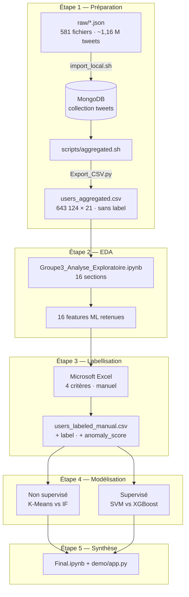

### 1.7 Cartographie des notebooks et datasets

| Ordre | Notebook | Dataset utilisé | Rôle |
|-------|----------|-----------------|------|
| — | — | `raw/*.json` | Entrée pipeline MongoDB (hors notebook EDA) |
| 1 | `Groupe3_Analyse_Exploratoire.ipynb` | `users_aggregated.csv` | EDA · 21 → 16 features |
| 2 | `Groupe3_Labelisation.ipynb` | — | Documentation procédure Excel |
| 3 | `Groupe3_profils_atypiques_non_Sup.ipynb` | `users_labeled_manual.csv` | K-Means vs Isolation Forest |
| 4 | `Groupe3_profils_atypiques_Sup.ipynb` | `users_labeled_manual.csv` | SVM vs XGBoost |
| 5 | `Groupe3_profils_atypiques_Final.ipynb` | — | Synthèse soutenance |
| (opt.) | `Groupe3_SVM_Noyaux_Annexe.ipynb` | Sous-échantillon | Comparaison noyaux SVM |

---

## 2. Contexte et problématique

### 2.1 Enjeu de la détection de profils atypiques

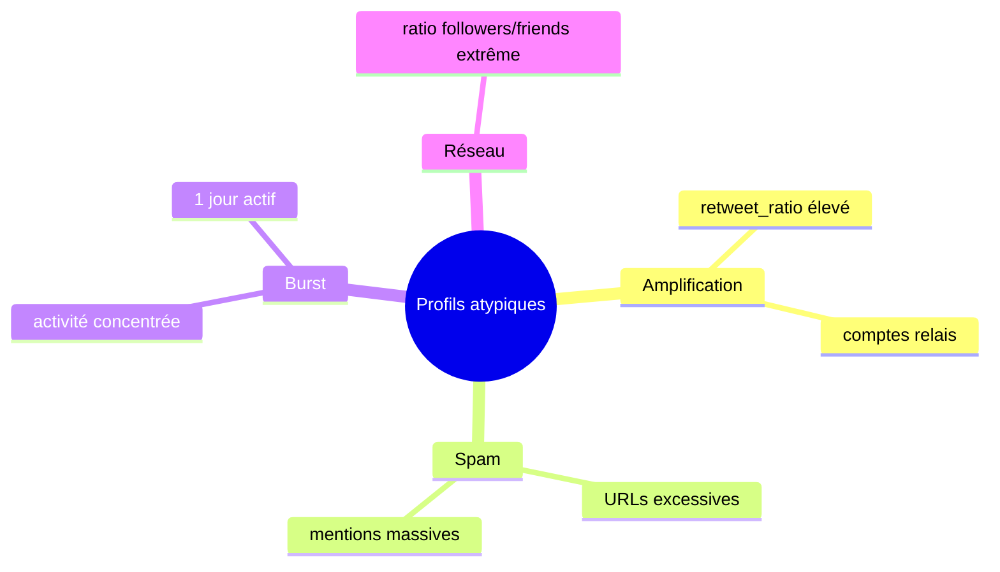

Sur les réseaux sociaux, une fraction non négligeable de comptes présente des comportements automatisés ou coordonnés : amplification de contenus (retweets massifs), spam (URLs et mentions excessives), activité concentrée sur une courte période, ou audiences artificiellement gonflées (ratio followers/friends extrême). Identifier ces profils est un enjeu pour :

- La **modération de contenu** et la lutte contre la désinformation ;
- La **qualité des analyses** de corpus (biais si bots non filtrés) ;
- La **compréhension des dynamiques** informationnelles lors d'événements massifs (ici, la Coupe du Monde).

### 2.2 Question de recherche

> *Comment comparer rigoureusement une approche non supervisée (sans labels) et une approche supervisée (avec labels) pour la détection de profils atypiques sur un grand corpus Twitter, et quels modèles retenir dans chaque famille ?*

Sous-questions :

1. Quels **indicateurs comportementaux** extraire des tweets bruts ?
2. Comment **labelliser** des profils en l'absence de ground truth officielle ?
3. Quels **algorithmes** choisir et comment **évaluer** leur concordance ?
4. Comment **éviter la circularité** entre règles de labellisation et features supervisées ?

### 2.3 Hypothèses de travail

1. Les variables agrégées au niveau **profil** (followers, activité, contenu) suffisent à discriminer une partie des comportements atypiques.
2. Une **ACP** préalable réduit la redondance entre features corrélées.
3. **Isolation Forest** détectera plus de profils déviants que K-Means sur un dataset massif et asymétrique.
4. **XGBoost** surpassera un SVM linéaire grâce à sa capacité non linéaire, sous réserve d'une évaluation **sans features des règles Excel**.

### 2.4 Lien avec les concepts du cours IF29

Ce projet mobilise explicitement les notions enseignées en **traitement de données** :

| Concept IF29 | Application concrète dans le projet |
|--------------|-------------------------------------|
| **Collecte et stockage** | Import JSONL, MongoDB, agrégation pipeline |
| **Nettoyage et qualité** | Filtrage tweets invalides, gestion valeurs nulles |
| **Statistiques descriptives** | EDA complète sur 643 124 profils |
| **Visualisation** | Histogrammes log1p, boxplots, heatmaps corrélation |
| **Feature engineering** | 21 variables agrégées, ratios dérivés |
| **Réduction de dimension** | ACP (7 et 5 composantes selon contexte) |
| **Normalisation** | StandardScaler |
| **Clustering** | K-Means (MiniBatchKMeans) |
| **Détection d'anomalies** | Isolation Forest |
| **Classification supervisée** | SVM, XGBoost |
| **Évaluation** | Métriques P/R/F1, ROC-AUC, matrices de confusion |
| **Gouvernance ML (L4)** | Cinq dimensions du modèle documentées |

---

## 3. Description des données

### 3.1 Source et volume

| Élément | Valeur |
|---------|--------|
| Dataset source | `Tweet_Worldcup` |
| Fichiers bruts | 581 fichiers JSONL (`raw/`) |
| Tweets | ~1 161 999 |
| Profils agrégés | 643 124 |
| Période | Juin 2018 (Coupe du Monde) |
| Stockage intermédiaire | MongoDB — collection `tweets` |
| Export final | `users_aggregated.csv` puis `users_labeled_manual.csv` |

**Hypothèse fondamentale :** l'analyse porte uniquement sur l'**auteur du tweet observé** (`user`). Les métadonnées de `retweeted_status.user` ne sont pas utilisées.

#### Schéma de granularité des données

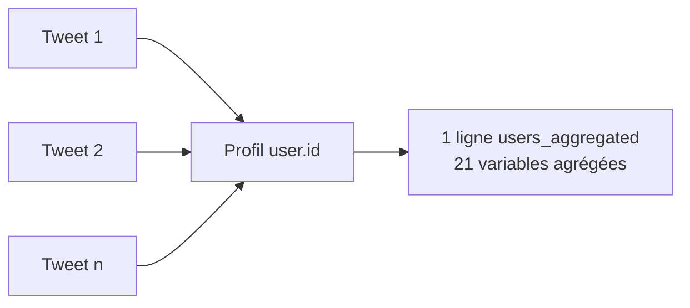

| Niveau | Granularité | Volume | Fichier / collection |
|--------|-------------|--------|----------------------|
| Brut | 1 ligne JSON = 1 tweet | ~1 161 999 | `raw/*.json` |
| Intermédiaire | 1 document MongoDB = 1 tweet | ~1 161 999 | `tweets` |
| Agrégé | 1 ligne = 1 profil (`user_id`) | 643 124 | `users_aggregated.csv` |
| Labelisé | 1 ligne = 1 profil + labels | 643 124 | `users_labeled_manual.csv` |

### 3.2 Structure d'un tweet brut (JSONL)

Chaque fichier `raw/*.json` est au format **JSONL** (une ligne JSON par tweet). Les champs exploités par le pipeline d'agrégation sont :

| Champ JSON | Type | Usage dans le pipeline |
|------------|------|------------------------|
| `user.id` | entier | Clé d'agrégation (`$group._id`) |
| `user.screen_name` | texte | Identité (exclu du ML) |
| `user.followers_count` | entier | Réseau social |
| `user.friends_count` | entier | Réseau social |
| `user.verified` | booléen | Signal de légitimité |
| `user.default_profile_image` | booléen | Personnalisation du profil |
| `user.lang` | texte | `profile_lang` (exclu du ML) |
| `text` | texte | Longueur moyenne des tweets |
| `created_at` | date string | Agrégation temporelle |
| `retweeted_status` | objet ou absent | `is_retweet_flag` → `nb_retweets` |
| `entities.hashtags` | tableau | `avg_hashtags` |
| `entities.urls` | tableau | `avg_urls` |
| `entities.user_mentions` | tableau | `avg_mentions` |
| `favorite_count` | entier | `avg_favorites` |
| `retweet_count` | entier | `avg_retweet_count` |

> **Non utilisé :** `retweeted_status.user.*` — seul l'auteur du tweet observé est analysé.

### 3.3 Pipeline de préparation (Étape 1)

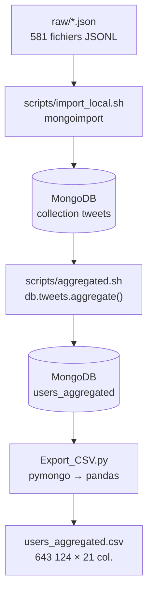

```
raw/*.json  →  MongoDB (collection tweets)  →  scripts/aggregated.sh  →  users_aggregated (MongoDB)
                                                                        ↓
                                                              Export_CSV.py  →  users_aggregated.csv
```

**Scripts :** `scripts/import_local.sh` (import JSONL) · `scripts/aggregated.sh` (agrégation) · `Export_CSV.py` (export CSV)

**Hypothèse d'agrégation :** seul l'**auteur du tweet observé** (`user`) est pris en compte. Les métadonnées de `retweeted_status.user` ne sont jamais utilisées — un retweet est comptabilisé comme activité de l'auteur du retweet, pas du compte original.

#### Pipeline MongoDB — `scripts/aggregated.sh`

Le script exécute `db.tweets.aggregate([...])` en six étapes :

| Étape | Opérateur | Rôle |
|-------|-----------|------|
| 1 | `$addFields` | Enrichissement **par tweet** : `is_retweet_flag` (présence de `retweeted_status`), `tweet_length` (`$strLenCP` sur `text`), comptages d'entités (`hashtags_count`, `urls_count`, `mentions_count`), conversion `created_at` → `tweet_date` |
| 2 | `$match` | Filtrage : `user.id` existant, `tweet_date` non nulle |
| 3 | `$group` | Agrégation par `user.id` : identité (`screen_name`, `verified`, `profile_lang`, `default_profile_image`), réseau (`followers_count`, `friends_count`), activité (`nb_tweets`, `nb_retweets`), moyennes de contenu et d'engagement, bornes temporelles, ensemble des jours actifs (`active_days_set` via `$dateToString` `%Y-%m-%d`) |
| 4 | `$addFields` | Variables dérivées : `active_days` = taille de `active_days_set`, `retweet_ratio`, `followers_friends_ratio` (si `friends_count = 0` → ratio = `followers_count`), `tweet_frequency` = `nb_tweets / active_days` (0 si aucun jour actif) |
| 5 | `$project` | Projection des **21 colonnes** finales (ML-ready) |
| 6 | `$out` | Écriture dans la collection MongoDB `users_aggregated` |

**Champs calculés à l'étape 1 (par tweet) :**

| Champ intermédiaire | Calcul |
|---------------------|--------|
| `is_retweet_flag` | 1 si `retweeted_status` présent, sinon 0 |
| `tweet_length` | Longueur Unicode de `text` (0 si absent) |
| `hashtags_count` | `$size` de `entities.hashtags` |
| `urls_count` | `$size` de `entities.urls` |
| `mentions_count` | `$size` de `entities.user_mentions` |
| `tweet_date` | `$dateFromString` sur `created_at` |

**Champs agrégés à l'étape 3 (par profil) :**

| Catégorie | Agrégation MongoDB |
|-----------|-------------------|
| Identité | `$first` sur les champs `user.*` |
| Activité | `$sum` : `nb_tweets` (+1 par tweet), `nb_retweets` (+ `is_retweet_flag`) |
| Contenu | `$avg` : `avg_tweet_length`, `avg_hashtags`, `avg_urls`, `avg_mentions` |
| Engagement | `$avg` avec `$ifNull` à 0 : `avg_favorites`, `avg_retweet_count` |
| Temporel | `$min` / `$max` : `first_tweet_date`, `last_tweet_date` ; `$addToSet` des dates journalières |

**Exécution :**

```bash
bash scripts/import_local.sh    # import JSONL → collection tweets
bash scripts/aggregated.sh      # agrégation → collection users_aggregated
python Export_CSV.py            # export → users_aggregated.csv
```

#### Détail de `scripts/import_local.sh`

| Étape | Action |
|-------|--------|
| 1 | Vérification de `mongoimport` et connexion MongoDB (`mongosh ping`) |
| 2 | Parcours de `raw/*.json` (581 fichiers) |
| 3 | Import ligne par ligne via `mongoimport --mode=insert` |
| 4 | Base cible : `database_local` · collection : `tweets` |

#### Détail de `Export_CSV.py`

```python
# Extrait simplifié — export sans champ _id MongoDB
cursor = db.users_aggregated.find({}, {"_id": 0})
df = pd.DataFrame(list(cursor))
df.to_csv("users_aggregated.csv", index=False)
```

L'agrégation produit **21 variables** par profil :

| Catégorie | Variables |
|-----------|-----------|
| **Identifiants** | `user_id`, `screen_name` |
| **Profil social** | `followers_count`, `friends_count`, `followers_friends_ratio`, `verified`, `default_profile_image`, `profile_lang` |
| **Activité** | `nb_tweets`, `nb_retweets`, `retweet_ratio` |
| **Contenu** | `avg_tweet_length`, `avg_hashtags`, `avg_urls`, `avg_mentions` |
| **Engagement** | `avg_favorites`, `avg_retweet_count` *(souvent nulles — collecte partielle)* |
| **Temporel** | `first_tweet_date`, `last_tweet_date`, `active_days`, `tweet_frequency` |

#### Formules des variables dérivées (étape 4 MongoDB)

| Variable | Formule | Cas particulier |
|----------|---------|-----------------|
| `retweet_ratio` | `nb_retweets / nb_tweets` | 0 si `nb_tweets = 0` |
| `followers_friends_ratio` | `followers_count / friends_count` | Si `friends_count = 0` → `followers_count` |
| `tweet_frequency` | `nb_tweets / active_days` | 0 si `active_days ≤ 0` |
| `active_days` | Nombre de dates distinctes `%Y-%m-%d` | Via `$addToSet` puis `$size` |

### 3.4 Analyse exploratoire des données (EDA)

**Notebook :** `Groupe3_Analyse_Exploratoire.ipynb`  
**Fichier unique analysé :** `users_aggregated.csv` — **643 124 profils**, **21 variables**, **aucun label**.  
**Principe :** aucune lecture de tweets bruts (JSON) ni de la collection MongoDB `tweets` dans ce notebook ; l'agrégation est réalisée en amont (§ 3.2).

L'EDA constitue l'**étape 2** du pipeline (avant labellisation) et répond à trois objectifs pédagogiques :

1. **Caractériser** la population de profils (volume, types, distributions, qualité).
2. **Identifier** les asymétries, corrélations et outliers guidant la définition des critères d'atypicité.
3. **Justifier** la réduction **21 → 16 features** et le choix de **7 composantes ACP** en modélisation non supervisée.

#### Plan du notebook — 16 sections

| § | Section EDA | Objectif analytique | Lien avec la suite du projet |
|---|-------------|---------------------|------------------------------|
| 1 | Cadre analytique | Définition opérationnelle d'atypicité, dimensions Ferrara/Chu/Varol | Cadre conceptuel labellisation |
| 2 | Chargement et vue d'ensemble | Structure du CSV, 21 colonnes | Vérification pipeline MongoDB |
| 3 | Statistiques descriptives | `describe()` complet + skewness / kurtosis | Asymétrie → `log1p` en viz. |
| 4 | Qualité des données | Types, valeurs manquantes | Fiabilité des features |
| 5 | Variables catégorielles | `verified`, `default_profile_image`, `profile_lang` | Exclusion `profile_lang` |
| 6 | Distributions (16 feat., log1p) | Histogrammes des features ML | Seuils pré-labellisation |
| 7 | Boxplots et percentiles | Outliers visuels (P95) | Justification règles Excel |
| 8 | Relations bivariées | Scatter plots (échantillon 20 k) | Corrélations comportementales |
| 9 | Sélection 21 → 16 | Tableau exclusion / rétention | Features ML non supervisé |
| 10 | Matrice de corrélation (%) | Redondance entre features | Justification ACP |
| 11 | Feature engineering exploratoire | Variables dérivées (ex. visibilité SPOT) | Pistes non retenues en ML |
| 12 | Outliers IQR | Comptage par feature | Profils extrêmes |
| 13 | Seuils exploratoires | Propositions de cutoffs | Origine des seuils Excel |
| 14 | ACP exploratoire | Scree plot, variance cumulée | **7 composantes** (seuil 75 %) |
| 15 | StandardScaler | Vérification normalisation | Pipeline ML commun |
| 16 | Synthèse EDA | Récapitulatif chiffré | Passage à la labellisation |

#### Synthèse quantitative de l'EDA (jeu complet)

| Indicateur | Valeur | Interprétation |
|------------|--------|----------------|
| Profils | 643 124 | 1 profil = 1 `user_id` unique |
| Variables agrégées | 21 | Export MongoDB |
| Features ML retenues | 16 | 5 exclues (identifiants, langue, dates brutes) |
| Comptes vérifiés (`verified`) | ~1,10 % | Classe minoritaire, signal de légitimité |
| Médiane `followers_count` | 316 | Queue longue (moyenne >> médiane) |
| Médiane `nb_tweets` | 1 | Majorité de profils peu actifs dans le corpus |
| Médiane `retweet_ratio` | 1,0 | Nombreux profils n'émettant que des retweets |
| Composantes ACP (seuil 75 %) | **7** | ~79 % de variance cumulée |
| Valeurs manquantes | Quasi nulles | Jeu directement exploitable après scaling |

**Constats structurants pour la modélisation :**

- **Distributions fortement asymétriques** (skewness élevée) sur `followers_count`, `nb_tweets`, `followers_friends_ratio` — justifient la normalisation `StandardScaler` et l'usage de `log1p` uniquement en visualisation.
- **Outliers nombreux** (méthode IQR) sur le ratio social, le volume de tweets et le `retweet_ratio` — cohérents avec la littérature sur bots et comptes d'amplification.
- **Corrélations partielles** entre variables d'activité et de contenu — motivent l'**ACP** avant les modèles pour réduire la redondance.

#### Schéma du flux EDA

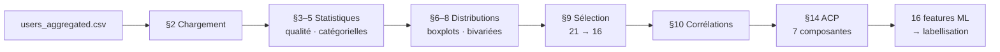

### 3.5 Réduction des variables (issue de l'EDA)

L'analyse exploratoire (`Groupe3_Analyse_Exploratoire.ipynb`) sur `users_aggregated.csv` (**sans labels**) a conduit à exclure **5 variables** du ML :

| Variable exclue | Justification |
|-----------------|---------------|
| `user_id`, `screen_name` | Identifiants — pas de valeur prédictive |
| `profile_lang` | Catégorielle peu informative dans ce contexte |
| `first_tweet_date`, `last_tweet_date` | Redondantes avec `active_days` / `tweet_frequency` |

**16 features ML** retenues pour la modélisation non supervisée.

| # | Feature ML retenue | Catégorie |
|---|-------------------|-----------|
| 1–3 | `followers_count`, `friends_count`, `followers_friends_ratio` | Réseau |
| 4–6 | `nb_tweets`, `nb_retweets`, `retweet_ratio` | Activité |
| 7–10 | `avg_tweet_length`, `avg_hashtags`, `avg_urls`, `avg_mentions` | Contenu |
| 11–12 | `avg_favorites`, `avg_retweet_count` | Engagement |
| 13–14 | `active_days`, `tweet_frequency` | Temporel |
| 15–16 | `verified`, `default_profile_image` | Profil binaire |

### 3.6 Caractéristiques statistiques du jeu

- **Peu ou pas de valeurs manquantes** sur le jeu agrégé — exploitable directement après normalisation.
- **Distributions fortement asymétriques** (queues longues) : médiane << moyenne sur `followers_count`, `nb_tweets`, etc.
- **Présence d'outliers** confirmée par boxplots tronqués au 95e percentile.
- **Corrélations notables** : par exemple entre `nb_tweets` et `retweet_ratio`, justifiant l'ACP en modélisation.

### 3.7 Labellisation manuelle

Après l'EDA, une labellisation **sous Microsoft Excel** (filtres, tri, inspection visuelle) produit `users_labeled_manual.csv` (+2 colonnes : `label`, `anomaly_score`).

> **Traçabilité pédagogique :** aucun script Python n'a généré les labels — le processus est **100 % manuel sous Excel**, conformément aux exigences de transparence du projet. Voir `docs/LABELISATION.md` pour le protocole détaillé.

**Quatre critères d'anomalie :**

| # | Règle | Condition | Interprétation |
|---|-------|-----------|----------------|
| 1 | Amplification | `retweet_ratio ≥ 0,8` | Compte qui retweete quasi systématiquement |
| 2 | Spam | `avg_urls ≥ 1,5` OU `avg_mentions ≥ 2` | Contenu surchargé |
| 3 | Burst | `active_days = 1` ET `nb_tweets ≥ 2` | Activité concentrée |
| 4 | Déséquilibre social | `followers_friends_ratio ≥ 30` | Audience disproportionnée |

**Règle finale :** atypique si **≥ 2 critères sur 4** (`anomaly_score ≥ 2`).

| Classe | Nombre | Proportion |
|--------|--------|------------|
| Normal (`label = 0`) | 534 199 | 83,1 % |
| Atypique (`label = 1`) | 108 925 | 16,9 % |

| `anomaly_score` | Profils |
|-----------------|---------|
| 0 | 147 681 |
| 1 | 386 518 |
| 2 | 103 247 |
| 3 | 5 600 |
| 4 | 78 |

Détails complets : [`docs/LABELISATION.md`](LABELISATION.md)

#### Origine des seuils — comptages EDA (section 13 du notebook)

Les seuils des règles Excel ont été **ancrés dans l'EDA** avant toute labellisation. Comptages sur le jeu complet (643 124 profils) :

| Critère exploratoire | Profils concernés | % du jeu | Règle Excel associée |
|---------------------|-------------------|----------|----------------------|
| `retweet_ratio ≥ 0,8` | 440 558 | 68,50 % | Règle 1 — Amplification |
| `avg_urls ≥ 1,5` | 2 551 | 0,40 % | Règle 2 — Spam |
| `avg_mentions ≥ 2` | 58 311 | 9,07 % | Règle 2 — Spam |
| `active_days = 1` ET `nb_tweets ≥ 2` | 97 952 | 15,23 % | Règle 3 — Burst |
| `followers_friends_ratio ≥ 30` | 10 895 | 1,69 % | Règle 4 — Déséquilibre social |

> Un profil n'est **atypique** que s'il cumule **≥ 2 critères sur 4** — d'où 16,9 % de labels positifs malgré des critères individuels parfois fréquents (ex. retweet_ratio).

#### Schéma décisionnel de la labellisation

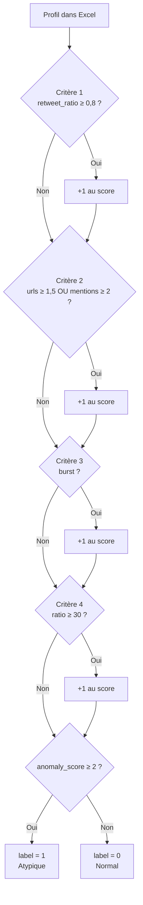

#### Schéma des fichiers de données

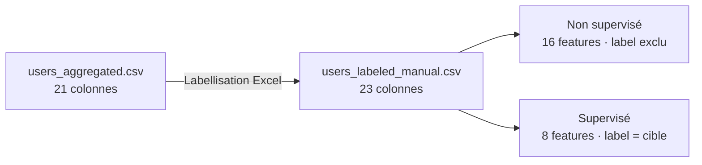

### 3.8 Description détaillée des 16 features ML

Chaque feature agrégée capture une facette du comportement du profil, en lien avec la littérature sur la détection de bots et comptes automatisés :

| Feature | Type | Description | Lien littérature |
|---------|------|-------------|------------------|
| `followers_count` | Numérique | Nombre d'abonnés au profil | Indicateur de visibilité / crédibilité perçue |
| `friends_count` | Numérique | Nombre de comptes suivis | Comptes bots suivent souvent massivement |
| `followers_friends_ratio` | Numérique | Ratio followers / friends | Déséquilibre social (Chu et al., 2012) |
| `nb_tweets` | Numérique | Tweets dans le corpus | Volume d'activité |
| `nb_retweets` | Numérique | Retweets émis | Comportement d'amplification |
| `retweet_ratio` | Numérique | Part de retweets dans l'activité | Signal d'automatisation (Ferrara et al., 2016) |
| `avg_tweet_length` | Numérique | Longueur moyenne des tweets | Contenu original vs minimal |
| `avg_hashtags` | Numérique | Hashtags moyens par tweet | Stratégie de visibilité |
| `avg_urls` | Numérique | URLs moyennes par tweet | Spam / redirection (Varol et al., 2017) |
| `avg_mentions` | Numérique | Mentions moyennes par tweet | Comportement de spam |
| `avg_favorites` | Numérique | Favoris moyens reçus | Engagement (données partielles) |
| `avg_retweet_count` | Numérique | Retweets moyens reçus | Portée (données partielles) |
| `active_days` | Numérique | Jours distincts d'activité | Régularité vs burst |
| `tweet_frequency` | Numérique | Tweets par jour actif | Intensité temporelle |
| `verified` | Binaire | Compte certifié | Signal de légitimité |
| `default_profile_image` | Binaire | Avatar par défaut | Comptes jetables / non personnalisés |

### 3.9 Qualité et intégrité des données

**Valeurs manquantes :** le pipeline MongoDB produit un jeu agrégé quasi-complet. Les colonnes `avg_favorites` et `avg_retweet_count` sont fréquemment nulles en raison d'une **collecte partielle** des métriques d'engagement dans le corpus source — elles sont conservées car informatives lorsqu'elles sont présentes, mais leur interprétation doit être nuancée.

**Doublons :** l'agrégation par `user_id` garantit un profil unique par utilisateur.

**Cohérence temporelle :** les dates `first_tweet_date` et `last_tweet_date` sont cohérentes avec `active_days` ; ces dates brutes sont exclues du ML au profit de variables dérivées plus compactes.

**Biais d'échantillonnage :** le corpus est limité aux tweets contenant des mots-clés liés à la Coupe du Monde — les profils très actifs sur le football y sont sur-représentés par rapport à une population Twitter générale.

---

## 4. Méthodologie

### 4.0 Registre des décisions méthodologiques

Chaque choix technique est **documenté, justifié et traçable** :

| # | Décision | Alternative écartée | Justification | Source |
|---|----------|---------------------|---------------|--------|
| D1 | Agrégation MongoDB par `user.id` | Agrégation Python ad hoc | Scalabilité, reproductibilité, pipeline unique | `scripts/aggregated.sh` |
| D2 | EDA **avant** labellisation | Labels puis EDA | Évite le biais de confirmation ; seuils ancrés dans les données | § Conformité |
| D3 | 16 features ML (non sup.) | 21 variables brutes | Exclusion identifiants, redondance temporelle | EDA § 9 |
| D4 | ACP 7 comp. (non sup.) | Toutes les features brutes | 79 % variance, réduction redondance | EDA § 14 |
| D5 | ACP 5 comp. (sup.) | 8 composantes | Saturation à 100 % avec 8 features | Notebook sup. |
| D6 | `contamination='auto'` (IF) | `contamination=0,05` fixe | Seuil inféré des scores (Liu et al., 2008), moins arbitraire | § 5.1 · Annexe G |
| D7 | k=7 (K-Means) | k variable non testé | Méthode du coude sur inertie (k ∈ [2, 10]) | Notebook non sup. |
| D8 | Seuil cluster < 1 % (KM) | Seuil 5 % | Clusters minoritaires = profils extrêmes compacts | Notebook non sup. |
| D9 | 8 features supervisées | 16 features complètes | Évite circularité label/règles (F1 ~0,97 → ~0,44) | § 4.4.1 |
| D10 | SVM **linéaire** | SVM RBF sur 643 k | O(n²) impraticable ; RBF testé en annexe sur sous-échantillon | `Groupe3_SVM_Noyaux_Annexe.ipynb` |
| D11 | Split 80/20 stratifié | Split aléatoire simple | Préserve la proportion 16,9 % d'atypiques dans train et test | Notebook sup. |
| D12 | `random_state=42` | Non fixé | Reproductibilité des résultats | Tous les notebooks |

### 4.1 Pipeline ML commun

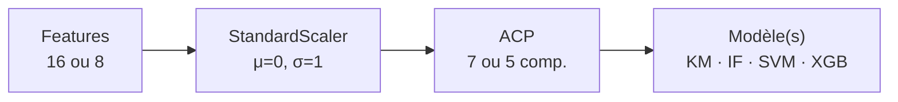

```
features  →  StandardScaler  →  ACP  →  modèle(s)
```

Ce pipeline est appliqué aux deux approches, avec des paramètres distincts selon le contexte.

#### Schéma comparatif des deux pipelines ML

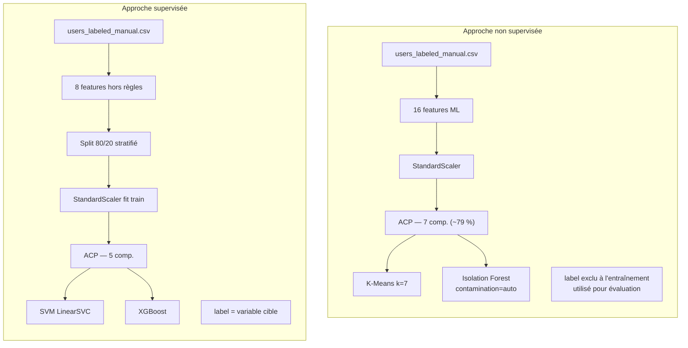

### 4.2 Analyse en composantes principales (ACP)

| Contexte | Features | Composantes | Variance expliquée | Justification |
|----------|----------|-------------|---------------------|---------------|
| Non supervisé | 16 | **7** | ~79 % | Seuil 75 % de variance cumulée (EDA section 11) |
| Supervisé | 8 | **5** | 100 % | Saturation — 8 features → max 8 composantes, 5 suffisent |

**Important :** ACP 7 comp. (non sup.), ACP 5 comp. (sup.) et **k=7** K-Means sont **trois décisions indépendantes**.

Critères Kaiser et seuils multiples testés :

| Critère | Composantes |
|---------|-------------|
| Kaiser (valeur propre > 1) | 5 |
| Seuil 70 % | 6 |
| **Seuil 75 % (retenu, non sup.)** | **7** |
| Seuil 80 % | 8 |

### 4.3 Approche non supervisée

**Notebook :** `Groupe3_profils_atypiques_non_Sup.ipynb`

**Entrée :** 16 features de `users_labeled_manual.csv`. Colonnes `label` et `anomaly_score` **exclues** à l'entraînement — utilisées uniquement pour l'évaluation a posteriori.

#### 4.3.1 K-Means (MiniBatchKMeans)

**Principe :** partitionner l'espace ACP en **k groupes** minimisant l'inertie intra-cluster. Les profils atypiques sont cherchés dans les **clusters minoritaires**.

| Paramètre | Valeur | Justification |
|-----------|--------|---------------|
| `n_clusters` (k) | **7** | Méthode du coude sur inertie (k ∈ [2, 10]) |
| `batch_size` | 10 000 | Scalabilité sur 643 k profils |
| `n_init` | 10 | Stabilité des centroïdes |
| `random_state` | 42 | Reproductibilité |

- **Règle d'atypicité :** profils appartenant à un cluster représentant **< 1 %** du dataset (~6 431 profils max par cluster ; en pratique 3 498 détectés).
- **Rôle :** baseline de clustering du cours — cherche des groupes compacts, pas des anomalies isolées.
- **Limite :** tous les profils atypiques KM sont aussi détectés par IF (0 KM seul).

#### 4.3.2 Isolation Forest

**Principe :** construire des arbres de partition aléatoire ; les points **faciles à isoler** (peu de splits) ont un score d'anomalie élevé (Liu et al., 2008).

| Paramètre | Valeur | Justification |
|-----------|--------|---------------|
| `n_estimators` | 100 | Compromis précision / temps |
| `contamination` | **`'auto'`** | Seuil inféré des scores — non arbitraire |
| `random_state` | 42 | Reproductibilité |

- Labels internes : **-1** = anomalie, **+1** = normal.
- **Rôle :** détection d'anomalies — isole les points « faciles à séparer » par des partitions aléatoires.
- **Résultat :** 42 987 profils (6,68 %) vs 32 141 (5 %) avec `contamination=0,05` fixe.

#### 4.3.3 Critères de comparaison K-Means vs Isolation Forest

| Critère | K-Means | Isolation Forest |
|---------|---------|------------------|
| Objectif | Segmentation | Détection d'anomalies |
| Sensibilité | Faible (~0,5 %) | Élevée (~6,7 %) |
| Volume détecté | ~3 498 profils | ~42 987 profils |
| Concordance | Consensus ~3 498 | IF seul ~39 489 |
| vs labels Excel | Rappel très faible | Rappel modéré, plus de FP |

**Modèle retenu : Isolation Forest** — conçu pour la détection d'anomalies, plus adapté à l'exploration initiale sans labels.

#### Procédure pas à pas — non supervisé

| Étape | Action | Détail technique |
|-------|--------|------------------|
| 1 | Chargement | `pd.read_csv("users_labeled_manual.csv")` |
| 2 | Sélection features | 16 colonnes ML ; exclusion de `label`, `anomaly_score`, identifiants |
| 3 | Cast binaires | `verified`, `default_profile_image` → int (0/1) |
| 4 | Normalisation | `StandardScaler().fit_transform(X)` sur l'intégralité (643 124) |
| 5 | ACP | `PCA(n_components=7)` → ~79 % variance cumulée |
| 6a | K-Means | `MiniBatchKMeans(n_clusters=7)` sur espace ACP |
| 6b | Isolation Forest | `IsolationForest(contamination='auto', n_estimators=100)` |
| 7 | Règle KM | Clusters < 1 % du jeu → atypiques (~3 498) |
| 8 | Règle IF | Prédiction `-1` → anomalie (~42 987) |
| 9 | Évaluation | Matrices de confusion vs `label` Excel (a posteriori) |

### 4.4 Approche supervisée

**Notebook :** `Groupe3_profils_atypiques_Sup.ipynb`

#### 4.4.1 Features hors règles Excel (anti-circularité)

Les labels découlent de règles sur `retweet_ratio`, `avg_urls`, `avg_mentions`, `active_days`, `nb_tweets`, `followers_friends_ratio`. Si le modèle reçoit ces variables, il **recopie les règles** (F1 ~ 0,970 avec 16 features).

**8 features retenues :**

`followers_count`, `friends_count`, `avg_tweet_length`, `avg_hashtags`, `avg_favorites`, `avg_retweet_count`, `verified`, `default_profile_image`

#### 4.4.2 Protocole d'entraînement

- Split **train/test 80/20 stratifié** sur `label`.
- Pipeline : `StandardScaler` (fit sur train) → **ACP 5 comp.** → modèle.
- **SVM :** `LinearSVC`, `class_weight='balanced'`.
- **XGBoost :** `scale_pos_weight` pour le déséquilibre des classes.

#### 4.4.3 Justification du SVM linéaire (pas de noyau RBF)

Un SVM à noyau RBF a un coût **O(n²)** — impraticable sur 514 000 lignes d'entraînement. Le noyau RBF a été testé en annexe sur sous-échantillon (`Groupe3_SVM_Noyaux_Annexe.ipynb`) ; le SVM linéaire reste la baseline scalable retenue.

**Modèle retenu : XGBoost** — meilleur F1 et ROC-AUC sur l'évaluation honnête.

#### Procédure pas à pas — supervisé

| Étape | Action | Détail technique |
|-------|--------|------------------|
| 1 | Chargement | `users_labeled_manual.csv` — 643 124 lignes |
| 2 | Sélection features | **8 features** hors règles Excel (anti-circularité) |
| 3 | Split | `train_test_split(test_size=0.20, stratify=label, random_state=42)` |
| 4 | Volumes | Train : **514 499** profils · Test : **128 625** profils |
| 5 | Scaling | `StandardScaler` fit **uniquement sur train**, transform train + test |
| 6 | ACP | `PCA(n_components=5)` fit sur train scalé → 100 % variance (8 feat.) |
| 7a | SVM | `LinearSVC(class_weight='balanced')` |
| 7b | XGBoost | `XGBClassifier(scale_pos_weight=ratio nég./posit.)` |
| 8 | Évaluation | Métriques sur **jeu test uniquement** |
| 9 | Annexe | Test 16 features → F1 ~0,97 (circularité démontrée) |

#### Schéma anti-circularité (supervisé)

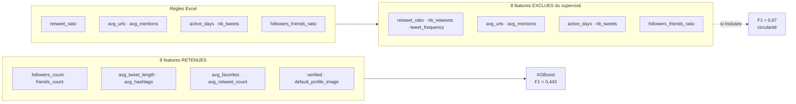

### 4.5 Méthodologie de comparaison supervisé vs non supervisé

Les deux approches ne partagent pas la même métrique native :

| Approche | Métrique principale | Évaluation vs labels |
|----------|--------------------|-----------------------|
| Non supervisée | Nombre / % de profils détectés | Matrice de confusion, P/R/F1 a posteriori |
| Supervisée | F1, ROC-AUC sur jeu test | Directe |

**Stratégie comparative :**

1. **Complémentarité fonctionnelle** : IF explore sans labels ; XGBoost classifie avec labels.
2. **Concordance partielle** : mesurer le chevauchement IF ↔ labels Excel (rappel ~8,5 %, précision ~21,5 %).
3. **Rigueur méthodologique** : traitement explicite de la circularité supervisée.
4. **Robustesse** : consensus K-Means ∩ IF (~3 498 profils) comme noyau d'anomalies.

### 4.6 Normalisation et prétraitement

**StandardScaler** (moyenne 0, variance 1) est appliqué à l'ensemble des features numériques avant l'ACP. Ce choix est motivé par :

- L'**hétérogénéité des échelles** : `followers_count` peut atteindre des dizaines de millions tandis que `avg_hashtags` reste proche de 0-5 ;
- La **sensibilité de l'ACP** aux variables de grande variance — sans scaling, `followers_count` dominerait les composantes ;
- La **compatibilité** avec SVM (sensible à la mise à l'échelle) et Isolation Forest (partitionne l'espace des features).

Les variables binaires `verified` et `default_profile_image` sont castées en entiers (0/1) avant scaling.

**Pas de transformation logarithmique en ML :** l'EDA utilise `log1p` uniquement pour la visualisation des distributions asymétriques ; la modélisation utilise les valeurs brutes après StandardScaler.

### 4.7 Politique de gestion du modèle (L4)

| Aspect | Décision retenue |
|--------|------------------|
| **Données d'entrée** | `users_labeled_manual.csv` — fichier unique, traçabilité MongoDB → CSV |
| **Paramètres d'entrée** | Hyperparamètres documentés dans les notebooks ; `random_state=42` pour reproductibilité |
| **Sorties** | Profils flaggés (IF : -1/+1 ; XGBoost : probabilité + classe) |
| **Métriques de suivi** | Non sup. : volume détecté, P/R/F1 vs labels ; Sup. : F1, AUC sur test |
| **Réentraînement** | Non automatisé — réentraînement manuel si nouveau corpus ou nouvelles règles |
| **Gouvernance** | Labels Excel = proxy métier ; pas de déploiement production sans validation experte |
### 4.8 Métriques d'évaluation — définitions

Les métriques sont choisies en fonction de la **nature de chaque approche** :

| Métrique | Formule (rappel) | Usage non supervisé | Usage supervisé |
|----------|------------------|---------------------|-----------------|
| **Volume détecté** | Nombre et % de profils flaggés | Métrique native IF / KM | — |
| **Accuracy** | (TP+TN) / N | Secondaire (classes déséquilibrées) | Rapportée |
| **Précision** | TP / (TP+FP) | vs labels Excel a posteriori | Rapportée |
| **Rappel (Recall)** | TP / (TP+FN) | vs labels Excel a posteriori | Rapportée |
| **F1-score** | 2·P·R / (P+R) | vs labels Excel a posteriori | **Métrique principale** (classe atypique) |
| **ROC-AUC** | Aire sous courbe ROC | — | **Métrique principale** (capacité de ranking) |
| **Consensus KM∩IF** | Intersection des détections | Noyau robuste d'anomalies | — |

**Convention :** en évaluation IF/KM vs labels Excel, la classe **positive** est `label = 1` (atypique) ; pour Isolation Forest, la prédiction positive est `prediction = -1` (anomalie).

### 4.9 Hyperparamètres consolidés

| Composant | Paramètre | Valeur | Notebook |
|-----------|-----------|--------|----------|
| **StandardScaler** | `with_mean`, `with_std` | True (défaut) | Tous |
| **ACP (non sup.)** | `n_components` | 7 | `non_Sup` |
| **ACP (sup.)** | `n_components` | 5 | `Sup` |
| **MiniBatchKMeans** | `n_clusters` | 7 | `non_Sup` |
| | `batch_size` | 10 000 | |
| | `n_init` | 10 | |
| | `random_state` | 42 | |
| **Isolation Forest** | `n_estimators` | 100 | `non_Sup` |
| | `contamination` | `'auto'` | |
| | `random_state` | 42 | |
| **LinearSVC** | `class_weight` | `'balanced'` | `Sup` |
| **XGBoost** | `scale_pos_weight` | ratio négatifs/positifs (train) | `Sup` |
| **Split train/test** | `test_size` | 0,20 | `Sup` |
| | `stratify` | `label` | |
| | `random_state` | 42 | |

### 4.10 Considérations éthiques et réglementaires

- **Données publiques** : le corpus `Tweet_Worldcup` contient des informations publiées volontairement sur une plateforme ouverte ; aucune donnée privée (DM, email) n'est traitée.
- **Pseudonymat** : les `screen_name` sont exclus du ML ; seuls des agrégats statistiques par profil sont modélisés.
- **Usage non discriminatoire** : les critères d'atypicité portent sur des **comportements** (amplification, spam, burst), pas sur des attributs sensibles (origine, genre, etc.).
- **Limites d'interprétation** : un profil « atypique » statistiquement n'est pas nécessairement un bot ou un compte malveillant — toute décision de modération requiert une **validation humaine**.
- **Pas de déploiement production** : le projet est académique ; aucun profil n'a fait l'objet d'une action automatisée en dehors du cadre pédagogique.

---

## 5. Résultats

### 5.1 Résultats non supervisés

**Configuration :** 643 124 profils · 16 features → `StandardScaler` → ACP 7 comp. (~79 % variance) · `random_state=42`

| Méthode | Profils détectés | % du jeu |
|---------|------------------|----------|
| K-Means (k=7, clusters < 1 %) | 3 498 | 0,54 % |
| **Isolation Forest (contamination auto)** | **42 987** | **6,68 %** |
| Consensus (K-Means ∩ IF) | 3 498 | 0,54 % |
| IF seul (hors consensus) | 39 489 | 6,14 % |
| K-Means seul | 0 | 0,00 % |

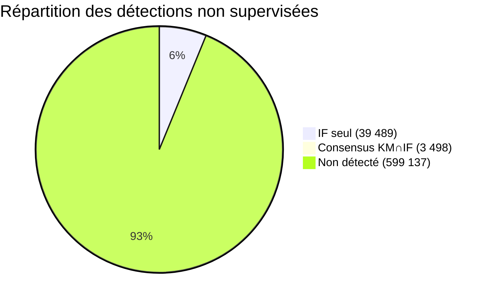

#### Isolation Forest vs labels Excel

| | Prédit Normal | Prédit Atypique |
|--|---------------|-----------------|
| **Label Normal** | 500 466 | 33 733 |
| **Label Atypique** | 99 671 | 9 254 |

| Métrique | Valeur |
|----------|--------|
| Précision | 0,215 |
| Rappel | 0,085 |
| F1 | 0,122 |
| Accuracy | 0,793 |

#### K-Means vs labels Excel

| Métrique | Valeur |
|----------|--------|
| Précision | 0,084 |
| Rappel | 0,003 |
| F1 | 0,005 |

Le K-Means isole un **noyau très compact** de profils extrêmes ; Isolation Forest **élargit significativement** la détection.

### 5.2 Résultats supervisés

**Configuration :** 8 features hors règles → `StandardScaler` (fit train) → ACP 5 comp. → modèle

| Jeu | Profils | Normaux (0) | Atypiques (1) | % atypiques |
|-----|---------|-------------|---------------|-------------|
| **Total** | 643 124 | 534 199 | 108 925 | 16,93 % |
| **Train (80 %)** | 514 499 | 427 359 | 87 140 | 16,93 % |
| **Test (20 %)** | 128 625 | 106 840 | 21 785 | 16,93 % |

Le split stratifié garantit la **même proportion de classes** dans train et test.

| Métrique | SVM | **XGBoost** |
|----------|-----|-------------|
| Accuracy | 0,559 | **0,667** |
| F1 (Atypique) | 0,361 | **0,443** |
| Recall | 0,737 | **0,783** |
| Precision | 0,239 | **0,309** |
| ROC-AUC | 0,670 | **0,794** |

#### Matrices de confusion (jeu test)

**SVM :**

| | Prédit 0 | Prédit 1 |
|--|----------|----------|
| Réel 0 | 55 875 | 51 012 |
| Réel 1 | 5 717 | 16 021 |

**XGBoost :**

| | Prédit 0 | Prédit 1 |
|--|----------|----------|
| Réel 0 | 68 824 | 38 063 |
| Réel 1 | 4 717 | 17 021 |

#### Importance des composantes (XGBoost)

PC1 et PC2 dominent l'importance — le modèle s'appuie principalement sur les directions de plus grande variance après ACP.

### 5.3 Démonstration de circularité (16 features — hors évaluation finale)

Avec les **16 features + ACP 7 comp.**, XGBoost atteint F1 ~ **0,970** : le modèle reproduit les règles Excel, pas une généralisation indépendante. Cette configuration est documentée en annexe du notebook supervisé mais **non retenue** pour l'évaluation finale.

### 5.4 Synthèse comparative

| | Isolation Forest | XGBoost |
|--|------------------|---------|
| Labels requis | Non | Oui |
| Features | 16 | 8 (hors règles) |
| ACP | 7 comp. | 5 comp. |
| Résultat clé | 42 987 profils (6,68 %) | F1 = 0,443 · AUC = 0,794 |
| Usage recommandé | Exploration initiale | Classification avec labels |

---

## 6. Discussion et analyse comparative

### 6.1 Apports de l'approche non supervisée

**Isolation Forest** permet de parcourir **643 124 profils sans annotation préalable**, en signalant ~6,7 % de profils aux scores d'anomalie élevés. C'est particulièrement utile en phase d'exploration, lorsque les critères d'atypicité ne sont pas encore formalisés.

Le passage de `contamination = 0,05` (fixe) à **`contamination = 'auto'`** supprime un degré d'arbitraire : le seuil est inféré des données plutôt qu'imposé. Sur notre jeu, cela porte la détection de 32 141 (5,00 %) à **42 987 (6,68 %)** profils — cohérent avec une population réellement plus « contaminée » que 5 % selon les scores d'isolation.

Le **consensus K-Means ∩ IF** (~3 498 profils) constitue un noyau robuste : les deux méthodes s'accordent sur ces profils extrêmes, renforçant la confiance dans leur caractère atypique.

### 6.2 Apports de l'approche supervisée

**XGBoost** exploite les labels pour atteindre un **F1 = 0,443** et un **ROC-AUC = 0,794** — performances modestes mais **scientifiquement honnêtes**, car évaluées sans les features directement liées aux règles Excel.

Le rappel élevé (0,783) indique une bonne **couverture des atypiques** ; la précision plus faible (0,309) traduit de nombreux faux positifs — attendu compte tenu du chevauchement partiel des classes en espace ACP.

### 6.3 Complémentarité des deux approches

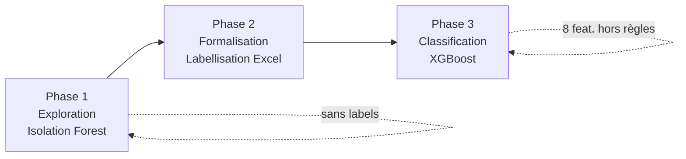

```
Phase 1 — Exploration     : Isolation Forest (sans labels)
Phase 2 — Formalisation   : Labellisation Excel (critères métier)
Phase 3 — Classification  : XGBoost (avec labels, sans circularité)
```

Les deux approches ne s'opposent pas : elles couvrent des **étapes différentes** du cycle de détection. L'IF ouvre l'exploration ; XGBoost discrimine une fois les labels disponibles.

### 6.4 Interprétation des écarts IF ↔ labels

Le faible rappel de l'IF vs labels Excel (8,5 %) s'explique par :

1. **Définitions différentes** : l'IF détecte des outliers statistiques multidimensionnels ; les règles Excel ciblent des comportements spécifiques (retweet, spam, burst).
2. **Seuil auto** : l'IF ne cherche pas à reproduire les 16,9 % de labels atypiques.
3. **Chevauchement partiel en ACP 2D** : normal et atypique se superposent — la séparation n'est pas triviale.

### 6.5 Analyse des profils consensus (K-Means ∩ IF)

Les **3 498 profils** détectés par les deux méthodes présentent en moyenne des valeurs extrêmes sur :

- `retweet_ratio` élevé (amplification quasi-systématique) ;
- `followers_friends_ratio` disproportionné (audiences gonflées ou comptes asymétriques) ;
- `avg_urls` et `avg_mentions` au-dessus de la médiane populationnelle.

Ce noyau constitue le **signal le plus robuste** du projet : deux algorithmes aux philosophies différentes (clustering vs isolation) convergent sur les mêmes profils. En revanche, les **39 489 profils détectés uniquement par l'IF** représentent des anomalies « diffuses » — profils statistiquement isolés qui ne satisfont pas forcément les critères Excel (ex. combinaison atypique de followers et longueur de tweets sans retweet excessif).

### 6.6 Leçons apprises

| Enseignement | Détail |
|--------------|--------|
| Ordre pipeline | EDA **avant** labellisation — évite le biais de conception des features |
| Circularité | Exclure les features des règles de label en supervisé — F1 passe de 0,97 à 0,44 |
| Contamination IF | `auto` plus justifiable qu'un 5 % arbitraire — +33 % de détections |
| Échelle | MiniBatchKMeans et LinearSVC permettent 643 k profils ; noyaux RBF non |
| Complémentarité | Non sup. et sup. répondent à des questions différentes — les confronter directement en F1 est incomplet |

### 6.7 Pistes d'amélioration

1. **Validation experte** : audit manuel de 500 profils IF pour estimer la précision réelle.
2. **Features textuelles** : TF-IDF, embeddings sur le contenu des tweets.
3. **Graphe social** : features de voisinage (followers communs, patterns de retweet).
4. **Semi-supervisé** : utiliser les labels sur un sous-ensemble pour affiner l'IF.
5. **Autres corpus** : généraliser au-delà du biais World Cup.
6. **Validation croisée** : k-fold stratifié sur le supervisé ; bootstrap sur échantillons IF.

---

## 7. Limites du projet

### 7.1 Limites des données

- **Biais thématique et temporel** : corpus World Cup 2018 — généralisation limitée à d'autres contextes.
- **Collecte partielle** : `avg_favorites` et `avg_retweet_count` souvent nulles.
- **Granularité profil** : un utilisateur actif pendant l'événement peut sembler atypique sans l'être structurellement.

### 7.2 Limites de la labellisation

- Labels **subjectifs**, non validés par un expert externe ou une vérité terrain.
- Règles Excel **corrélées aux features** — risque de circularité (traité explicitement en supervisé).
- Seuil « ≥ 2 critères sur 4 » arbitraire mais documenté et justifié par l'EDA.

### 7.3 Limites des modèles

- **IF `contamination = auto`** : le pourcentage détecté (6,68 %) n'est pas contrôlé explicitement ; il dépend de la distribution des scores.
- **K-Means** : sous-détecte massivement vs labels ; sensible au choix de k et au seuil 1 %.
- **XGBoost F1 modeste** : sans features des règles, la séparation reste difficile.
- **Pas de validation croisée** sur le non supervisé (coût computationnel sur 643 k profils).

### 7.4 Limites organisationnelles

- Pas de déploiement en production ni de politique de réentraînement automatisé.
- Évaluation qualitative des profils détectés limitée (pas d'audit manuel exhaustif des 42 987 profils IF).

---

## 8. Conclusion et recommandations

### 8.1 Réponses aux questions de recherche

| Question | Réponse synthétique |
|----------|---------------------|
| **Q1 — Quels indicateurs extraire ?** | 21 variables agrégées MongoDB (identité, réseau, activité, contenu, engagement, temporalité), réduites à **16 features ML** après EDA. |
| **Q2 — Comment labelliser sans ground truth ?** | Quatre critères comportementaux (amplification, spam, burst, déséquilibre social), comptés manuellement sous Excel ; atypique si **≥ 2/4**. |
| **Q3 — Quels algorithmes retenir ?** | **Isolation Forest** (non sup.) — détection d'anomalies à grande échelle ; **XGBoost** (sup.) — meilleur F1/AUC sans circularité. |
| **Q4 — Comment éviter la circularité ?** | Exclusion des 8 features impliquées dans les règles Excel pour le supervisé ; démonstration annexe F1 ~0,97 vs ~0,44. |

### 8.2 Conclusion

Ce projet démontre une **méthodologie complète et reproductible** pour comparer détection non supervisée et classification supervisée de profils atypiques Twitter :

1. **Pipeline de données** : JSON → MongoDB → agrégation → 643 124 profils, 21 → 16 features.
2. **Labellisation argumentée** : 4 critères inspirés de l'EDA et de la littérature, 16,9 % d'atypiques.
3. **Non supervisé retenu : Isolation Forest** (`contamination = auto`) — 42 987 profils (6,68 %) pour l'exploration.
4. **Supervisé retenu : XGBoost** — F1 = 0,443, ROC-AUC = 0,794, évaluation sans circularité.
5. **Contribution méthodologique** : traitement explicite de la circularité label/features, comparaison rigoureuse des approches.

### 8.3 Recommandations

| Contexte | Recommandation |
|----------|----------------|
| Exploration initiale | Isolation Forest sur l'ensemble, sans labels |
| Formalisation des critères | Labellisation experte sur échantillon des profils IF |
| Classification | XGBoost avec features hors règles de labellisation |
| Validation | Audit manuel d'un échantillon des profils consensus |
| Perspectives | Autres corpus, validation croisée, deep learning sur contenu textuel |

---

## 9. Bibliographie

- Chu, Z., Gianvecchio, S., Wang, H., & Jajodia, S. (2012). *Detecting automation of Twitter accounts: Are you a human, bot, or cyborg?* IEEE Transactions on Dependable and Secure Computing, 9(6), 811-824.
- Ferrara, E., Varol, O., Davis, C., Menczer, F., & Flammini, A. (2016). *The rise of social bots.* Communications of the ACM, 59(7), 96-104.
- Liu, F. T., Ting, K. M., & Zhou, Z.-H. (2008). *Isolation Forest.* ICDM, 413-422.
- Varol, O., Ferrara, E., Davis, C. A., Menczer, F., & Flammini, A. (2017). *Online human-bot interactions: Detection, estimation, and characterization.* Proceedings of ICWSM, 280-289.

---

*Fin du corps du rapport (sections 1 à 9) — volume estimé : **22–24 pages** en mise en forme A4 (police 11 pt, interligne 1,15, tableaux et schémas inclus). Les annexes (section 10) sont fournies en complément et ne sont pas comptées dans cette pagination.*

---

## 10. Annexes

> Les annexes complètent le corps du rapport (sections 1 à 9) sans compter dans le volume cible de **20–25 pages**.

### Annexe 0 — Conformité à l'énoncé IF29

#### Énoncé du projet

> *Comparer deux approches de classification appliquées à la détection de profils « atypiques » sur Twitter : une approche **non supervisée** et une approche **supervisée**.*

#### Tableau de conformité

| Exigence IF29 | Réalisation | Référence |
|---------------|-------------|-----------|
| Deux approches | K-Means + IF · SVM + XGBoost | § 4.3–4.4 |
| Comparaison intra-famille | IF retenu · XGBoost retenu | § 5–6 |
| Pipeline documenté | MongoDB → CSV | § 3.3 |
| EDA avant ML | 16 sections, sans labels | § 3.4 |
| Labellisation | Excel, 4 critères | § 3.7 |
| ACP + scaling | StandardScaler → ACP | § 4.1–4.2 |
| Limites | § 7 | Auto-critique |
| L1–L4 | Matrice ci-dessous | § 1.4 |

#### Chronologie méthodologique

```
Étape 1 — Agrégation MongoDB     → users_aggregated.csv
Étape 2 — EDA                    → 21 → 16 features
Étape 3 — Labellisation Excel    → users_labeled_manual.csv
Étape 4 — Non supervisé          → K-Means vs IF
Étape 5 — Supervisé              → SVM vs XGBoost
Étape 6 — Synthèse               → Final + demo
```

### Annexe L2 — Livrable code documenté

| Exigence L2 | Réalisation |
|-------------|-------------|
| Dépôt GitHub | [PROJET_IF29-GR03](https://github.com/ElProfesormika/PROJET_IF29-GR03) |
| README installation | `README.md` — venv, `pip install -r requirements.txt` |
| README utilisation | Ordre notebooks § 1.7 · scripts bash documentés |
| Dépendances | `requirements.txt` (pandas, scikit-learn, xgboost, pymongo, streamlit…) |
| Code structuré | `scripts/` · `demo/` · 6 notebooks à la racine |
| Dataset final | `users_labeled_manual.csv` — utilisé par notebooks non sup. et sup. |
| Commentaires | Cellules markdown dans chaque notebook + ce rapport |

#### Arborescence du dépôt

```
IF29/
├── README.md · README_data.md · requirements.txt
├── docs/RAPPORT_PROJET.md · LABELISATION.md · EQUIPE_ROLES.md
├── scripts/import_local.sh · aggregated.sh · run_demo.sh
├── Export_CSV.py
├── demo/app.py                    # Portail Streamlit (L3)
├── users_aggregated.csv           # 643 124 × 21
├── users_labeled_manual.csv       # 643 124 × 23
├── Groupe3_Analyse_Exploratoire.ipynb
├── Groupe3_Labelisation.ipynb
├── Groupe3_profils_atypiques_non_Sup.ipynb
├── Groupe3_profils_atypiques_Sup.ipynb
├── Groupe3_profils_atypiques_Final.ipynb
└── Groupe3_SVM_Noyaux_Annexe.ipynb
```

### Annexe A — Répartition des rôles (L4)

Voir [`docs/EQUIPE_ROLES.md`](EQUIPE_ROLES.md) pour le détail par membre et les cinq dimensions du modèle ML :

| Dimension ML | Rôle | Membre |
|--------------|------|--------|
| Données d'entrée | Data Engineer | Housseni YABRE |
| Paramètres d'entrée | Data Analyst | Vanelle Leita FOTSO AKOUDOUM |
| Métriques d'état du modèle | Data Scientist (non sup.) | Samella LEUKOUO |
| Sorties cibles / Résultats | ML Engineer (sup.) | Dorcas ADRAKE |
| Politique de gestion du modèle | ML Project Manager / CDO | Ace ANALLA |

### Annexe B — Notebooks du projet

| Notebook | Contenu |
|----------|---------|
| `Groupe3_Analyse_Exploratoire.ipynb` | EDA 16 sections, corrélations, réduction 21 → 16 features, ACP exploratoire |
| `Groupe3_Labelisation.ipynb` | Documentation du processus Excel |
| `Groupe3_profils_atypiques_non_Sup.ipynb` | K-Means vs Isolation Forest |
| `Groupe3_profils_atypiques_Sup.ipynb` | SVM vs XGBoost, annexe circularité |
| `Groupe3_profils_atypiques_Final.ipynb` | Synthèse soutenance |
| `Groupe3_SVM_Noyaux_Annexe.ipynb` | Comparaison noyaux SVM (sous-échantillon) |

### Annexe C — Reproduction complète du projet

#### Prérequis

- Python 3.10+, MongoDB local (`mongosh`, `mongoimport`)
- Fichiers `raw/*.json` (581 JSONL Tweet_Worldcup)
- `users_aggregated.csv` et `users_labeled_manual.csv` (fournis ou générés)

#### Étape 1 — Environnement Python

```bash
cd IF29
python3 -m venv venv_if29
source venv_if29/bin/activate
pip install -r requirements.txt
```

#### Étape 2 — Pipeline MongoDB (si reconstruction depuis les JSON)

```bash
# Démarrer MongoDB local, puis :
bash scripts/import_local.sh      # raw/*.json → collection tweets
bash scripts/aggregated.sh        # tweets → collection users_aggregated
python Export_CSV.py              # MongoDB → users_aggregated.csv
```

#### Étape 3 — Notebooks (ordre recommandé)

| Ordre | Notebook | Entrée | Sortie attendue |
|-------|----------|--------|-----------------|
| 1 | `Groupe3_Analyse_Exploratoire.ipynb` | `users_aggregated.csv` | Justification 16 features, ACP 7 comp. |
| 2 | `Groupe3_Labelisation.ipynb` | — | Documentation labels (Excel manuel) |
| 3 | `Groupe3_profils_atypiques_non_Sup.ipynb` | `users_labeled_manual.csv` | IF : 42 987 profils ; KM : 3 498 |
| 4 | `Groupe3_profils_atypiques_Sup.ipynb` | `users_labeled_manual.csv` | XGBoost F1 ≈ 0,443 |
| 5 | `Groupe3_profils_atypiques_Final.ipynb` | — | Synthèse soutenance |
| (opt.) | `Groupe3_SVM_Noyaux_Annexe.ipynb` | Sous-échantillon | Comparaison noyaux SVM |

#### Étape 4 — Portail de démonstration (L3)

```bash
bash scripts/run_demo.sh   # → http://localhost:8501
```

#### Vérification de cohérence

| Contrôle | Valeur attendue |
|----------|-----------------|
| Lignes `users_aggregated.csv` | 643 124 |
| Colonnes agrégées | 21 |
| Colonnes labelisées | 23 (`label`, `anomaly_score` ajoutés) |
| % atypiques (`label=1`) | ~16,9 % |
| IF profils détectés (`contamination='auto'`) | 42 987 (~6,68 %) |

### Annexe D — Matrice K-Means vs Isolation Forest

| | IF Normal | IF Atypique |
|--|-----------|-------------|
| **KM Normal** | 600 137 | 39 489 |
| **KM Atypique** | 0 | 3 498 |

### Annexe E — Détail du pipeline MongoDB (`scripts/aggregated.sh`)

**Chaîne complète :**

1. **`scripts/import_local.sh`** — importe les 581 fichiers JSONL (`raw/*.json`) dans la collection MongoDB `tweets` via `mongoimport`.
2. **`scripts/aggregated.sh`** — pipeline d'agrégation (voir § 3.2) : enrichissement tweet → filtrage → `$group` par `user.id` → ratios → projection 21 colonnes → `$out: "users_aggregated"`.
3. **`Export_CSV.py`** — exporte la collection `users_aggregated` vers `users_aggregated.csv` (643 124 lignes).

**Résultat :** un profil unique par `user_id`, avec comptages (`nb_tweets`, `nb_retweets`), moyennes (`avg_*`), ratios (`retweet_ratio`, `followers_friends_ratio`, `tweet_frequency`), métadonnées profil et indicateurs temporels (`active_days` = nombre de jours distincts d'activité dans le corpus).

**Point clé — `active_days` :** calculé via `$addToSet` des dates au format `%Y-%m-%d`, puis `$size` — ce n'est pas la différence calendaire entre `first_tweet_date` et `last_tweet_date`, mais le nombre réel de jours où le profil a tweeté au moins une fois.

### Annexe F — État des features supervisées exclues

Les 8 features **exclues** du supervisé honnête sont précisément celles impliquées dans les règles Excel :

| Feature exclue | Règle Excel associée |
|----------------|---------------------|
| `retweet_ratio` | Règle 1 — Amplification |
| `avg_urls` | Règle 2 — Spam |
| `avg_mentions` | Règle 2 — Spam |
| `active_days` | Règle 3 — Burst |
| `nb_tweets` | Règle 3 — Burst |
| `followers_friends_ratio` | Règle 4 — Déséquilibre social |
| `nb_retweets` | Corollaire de retweet_ratio |
| `tweet_frequency` | Corollaire de active_days / nb_tweets |

### Annexe G — Comparaison contamination fixe vs auto

| Paramètre | `contamination = 0,05` | `contamination = 'auto'` |
|-----------|------------------------|--------------------------|
| Profils détectés | 32 141 | 42 987 |
| % du jeu | 5,00 % | 6,68 % |
| Justification | Hypothèse arbitraire | Seuil inféré des scores (Liu et al., 2008) |
| IF seul (hors KM) | 28 643 | 39 489 |
| Rappel vs labels | ~7,5 % | ~8,5 % |

Le mode `auto` détecte environ **10 846 profils supplémentaires** (+33,7 %), avec une légère amélioration du rappel vis-à-vis des labels Excel, tout en conservant le même noyau consensus avec K-Means (3 498 profils).

### Annexe H — Portail de démonstration (L3)

Le portail Streamlit (`demo/app.py`) centralise pour la soutenance :

- Pipeline de données et schéma MongoDB ;
- Visualisations EDA (distributions, corrélations, boxplots) ;
- Labellisation et distribution des scores ;
- Résultats non supervisés et supervisés ;
- Synthèse comparative et fiches équipe (L4).

Lancement : `bash scripts/run_demo.sh` → http://localhost:8501

### Annexe I — Glossaire

| Terme | Définition dans ce projet |
|-------|---------------------------|
| **Profil atypique** | Compte dont les caractéristiques agrégées s'écartent significativement de la population ; opérationnellement : `label = 1` si ≥ 2 critères Excel sur 4. |
| **Anomalie (IF)** | Profil avec score d'isolation élevé ; prédit `-1` par Isolation Forest. |
| **Consensus KM∩IF** | Profils détectés à la fois par K-Means (cluster < 1 %) et Isolation Forest. |
| **Circularité** | Situation où les features du modèle supervisé recopient les règles de labellisation → F1 artificiellement élevé. |
| **Proxy de vérité terrain** | Labels Excel — non validés par un expert externe, mais reproductibles et documentés. |
| **Feature** | Variable numérique ou binaire utilisée en entrée du modèle ML. |
| **ACP** | Analyse en Composantes Principales — rotation linéaire réduisant la dimension tout en conservant la variance. |
| **contamination (IF)** | Proportion attendue d'anomalies ; `'auto'` infère le seuil des scores plutôt que d'imposer un %. |

### Annexe J — Schéma d'architecture des données

```
┌─────────────────┐     import_local.sh      ┌──────────────────┐
│  raw/*.json     │ ────────────────────────► │ MongoDB: tweets  │
│  (581 JSONL)    │                           │  (~1,16 M docs)  │
└─────────────────┘                           └────────┬─────────┘
                                                       │ aggregated.sh
                                                       ▼
                                              ┌──────────────────────┐
                                              │ MongoDB:             │
                                              │ users_aggregated     │
                                              │ (643 124 profils)    │
                                              └──────────┬───────────┘
                                                         │ Export_CSV.py
                                                         ▼
┌──────────────────────────────────────────────────────────────────────┐
│ users_aggregated.csv (21 col., sans label)                           │
│   → EDA (16 sections) → labellisation Excel → users_labeled_manual │
└──────────────────────────────────────────────────────────────────────┘
         │                                        │
         ▼                                        ▼
  Non supervisé (16 feat., ACP 7)          Supervisé (8 feat., ACP 5)
  K-Means vs Isolation Forest              SVM vs XGBoost
```

---

*Fin du rapport — Projet IF29 Groupe 3 — Juin 2026*
